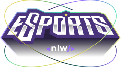

<p align="center">
</p>

<br>

Projeto Next Level Week eSports da Rocketseat.

<hr>

## Descrição

> O projeto se chama *Find your Duo*.

> O projeto é uma plataforma para você publicar e/ou achar um anúncio de alguem procurando por um duo com base nos jogos mais vistos da twitch.

<p align="center">
</p>

## Tecnologias e ferramentas
* [Node.js](https://nodejs.org/en/)
* [Prisma](https://www.prisma.io/)
* [React](https://reactjs.org/)
* [React Native](https://reactnative.dev/)
* [Expo](https://expo.dev/)
* [Figma](https://www.figma.com/)
* [Radix UI](https://www.radix-ui.com/)


## Rodar localmente

### Server

Primeiro crie um novo arquivo ``.env`` no diretório raíz.

Então para criar o banco de dados local, use os comandos :
```sh
$ npm install
$ npm run db:migrate
```

Após isso é só iniciar o servidor:
```sh
$ npm run dev
```

### Web

Para iniciar o Vite web client, use os comandos :
```sh
$ npm install
$ npm run dev
```
